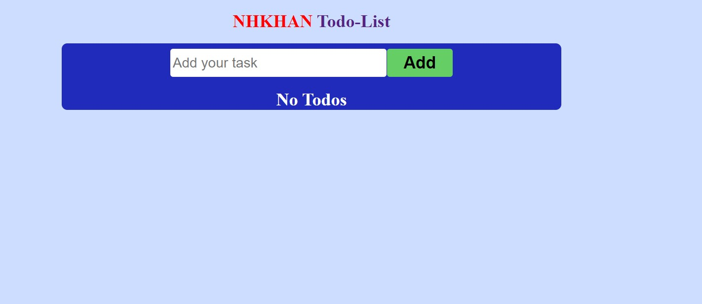
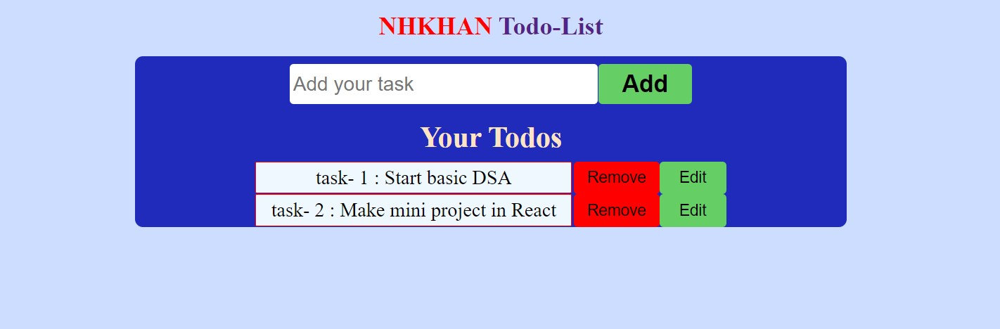
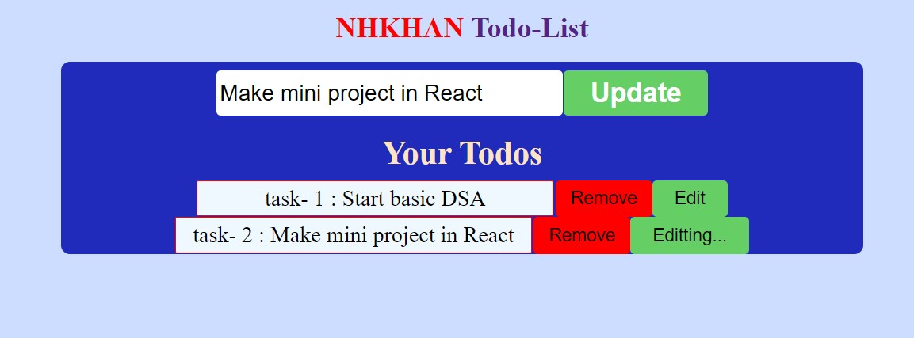
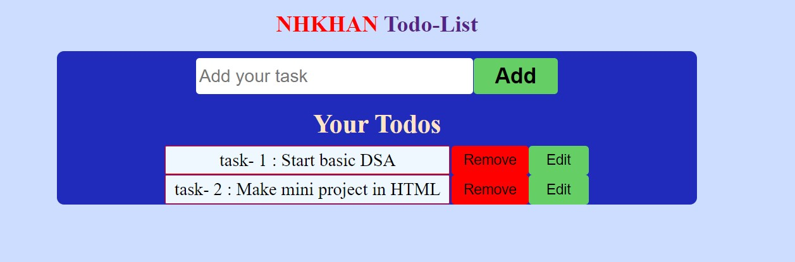

### Tech Stack :
- `HTML`
- `CSS`
- `REACT`
## Features:
`1` User can `Add Todo`.  
`2` User can `Delete Todo`.  
`3` User can `Edit and Update Todo`.  

# Snipppets

- ### HOME:  

- ### Add Todo:  

- ### Edit Todo:  

- ### Edit & Update to Todo:  

