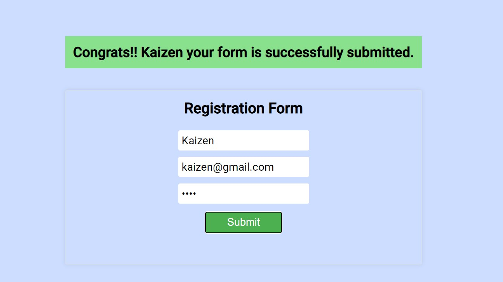

<h1 align="center">  Registration From </h1>

### Tech Stack :
- `HTML`
- `CSS`
- `REACT`
## Features:
- User can `Register`  by proving all the fields.  

# Snipppets

- ### HOME:  

- ### Form submitting without  filling the fields:  

- ### Successfully submitted:  
