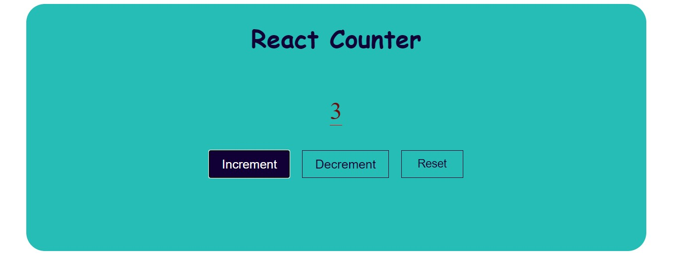

### React Beginner Projects practice: 

# Below are the projects Snippets 

### To create a React application using Vite, you can follow these steps:

- Install `Node.js and npm`: If you haven't already, install Node.js and npm on your computer. You can download them from the official website: `Node.js Downloads`.

- **Install Vite Globally**: Open your terminal or command prompt and install Vite globally using npm: `npm install -g create-vite or npx use`
- This will install the create-vite command-line tool `globally`, which you can use to create Vite projects.
- `Create a New React Vite Project`: To create a new React application, open your terminal and run the following command: `create-vite my-react-app --template react`
- Replace `my-react-app` with the `name you want for your project`. The `--template react` flag specifies that you want to create a Vite project with the React template.
- **Remark**: react app must be in small case all letter(But now we can keep capital)
	
- Navigate to the project directory: `cd my-react-app`
- Install project dependencies(node_module): `npm install`
- Start the development server: `npm run dev`
- **NOTE:** to run app use  npm run dev
